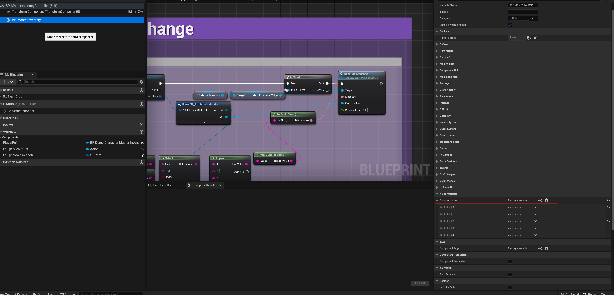
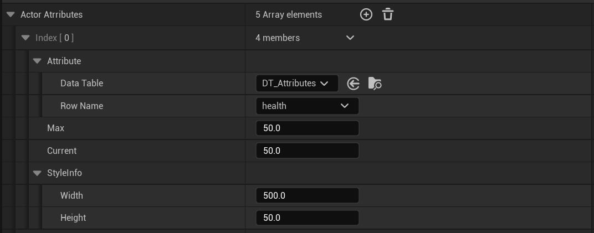
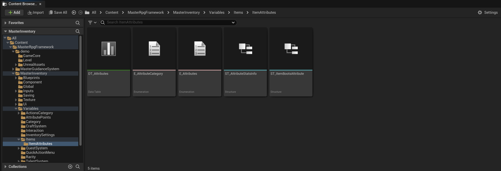
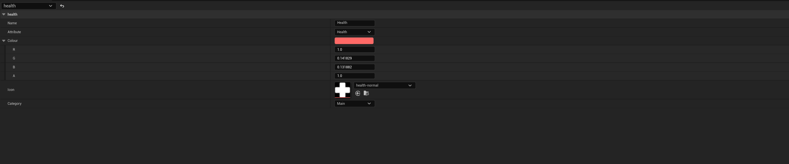
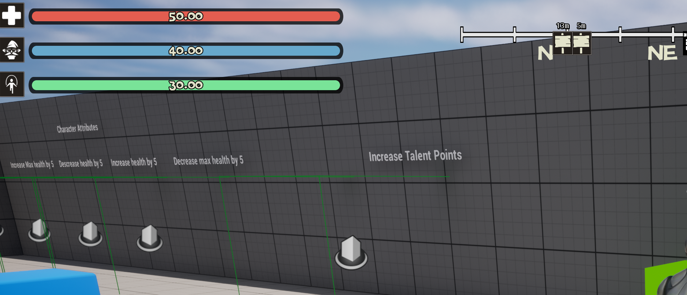
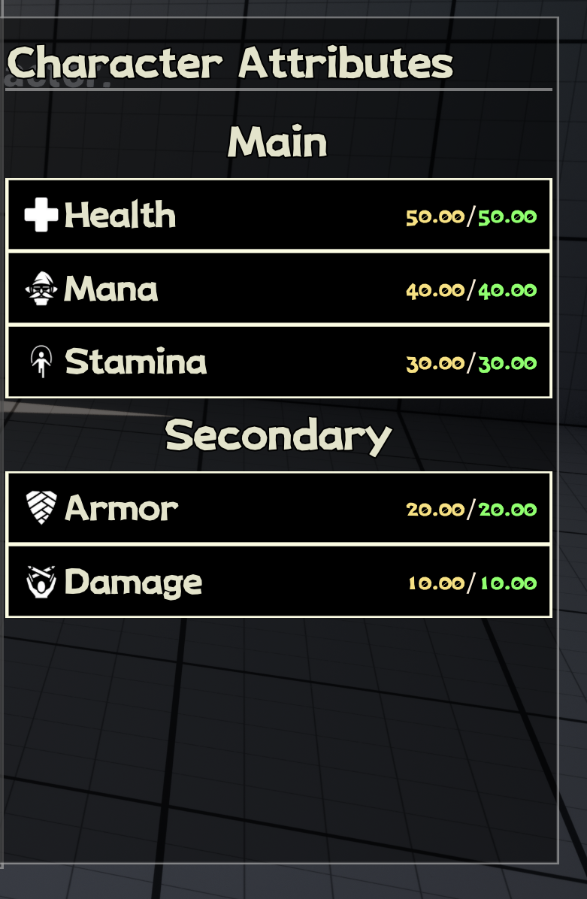

Master Inventory also comes with a powerful attribute system that allows you to add custom attributes to your items. These attributes can be used to add custom effects to your items, such as adding a custom enchantment to an item, or adding a custom potion effect to an item.

## Adding Attributes to the player

The way the attribute system works is attached to the `BP_MasterInventory` component to add attributes systems to the player, do the following:

1. Open the `BP_MasterInventory` component and find the variable `Actor Attribute`.

2. Click in the plus button to add a new attribute and follow the configuration below:

In this image we have the following configuration variables:

| Name | Description |
| --- | --- |
|Attribute | datatable this is where you pick your attribute you want to use|
|Max | this is the max value of the attribute|
|Current | use in real time to change the value of the attribute|
|Style Info | control the size of the bar in the main hud if the attribute has the category of main|

## Creating new attributes

To create a new attribute, do the following:

1. Open the `DT_Attributes` located at `MasterInventory/Content/MasterRpgFramework/MasterInventory/Variables/Items/ItemAttributes/DT_Attributes`.

2. Open the datatable and add a new row, then follow the configuration below:

In this image we have the following configuration variables:

| Name | Description |
| --- | --- |
|Name | At the moment is used only to search in the datatable|
|Attribute | this is the name of the attribute that will be used in the code, note this is a Enum located at `MasterInventory/Content/MasterRpgFramework/MasterInventory/Variables/Items/ItemAttributes/E_Attributes` |
|Color | this is the color of the attribute, this is used in the main hud to color the bar of the attribute|
|Icon | this is the icon of the attribute, this is used in the main hud to show the icon of the attribute|
|Category | this is the category of the attribute, also a Enum located at `MasterInventory/Content/MasterRpgFramework/MasterInventory/Variables/Items/ItemAttributes/E_AttributeCategory`|

Now for the category anything with the category of main it will show in the main bars.

everything else will be display in the character sheet.

## Manage `BP_MasterInventory` attributes methods

| Event Name | Description |
| --- | --- |
| API_IncreaseMaxAttribute | Increase the max value of the attribute |
| API_DecreaseMaxAttribute | Decrease the max value of the attribute |
| API_DecreaseAttribute | Decrease the current value of the attribute |
| API_IncreaseAttribute | Increase the current value of the attribute |

## Information links
[tutorial-setup](https://www.youtube.com/watch?v=eNHuHR0dG0c)
