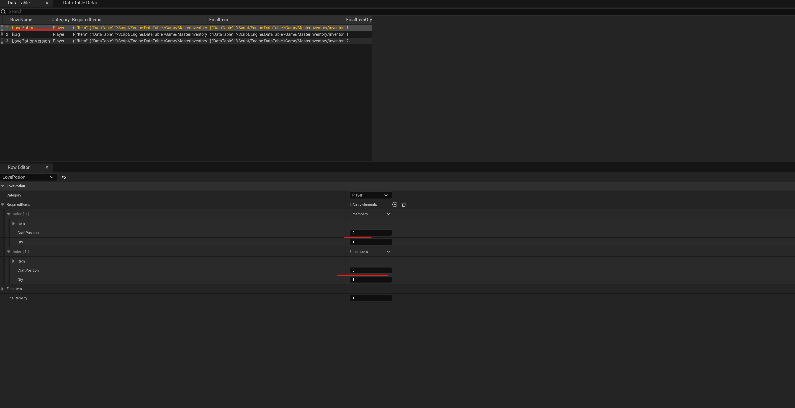

To create new recipes open the navigate to `MasterInventory/inventory/Variables/CraftSystem` and open the file `DT_CraftRecipes` that control the recipes input and outputs.

Note the `craftPosition` variable will be use to indicate the `position` where the item need to be place by the player in order to craft the item, note case of duplicate recipes the system will pickup the first one.

