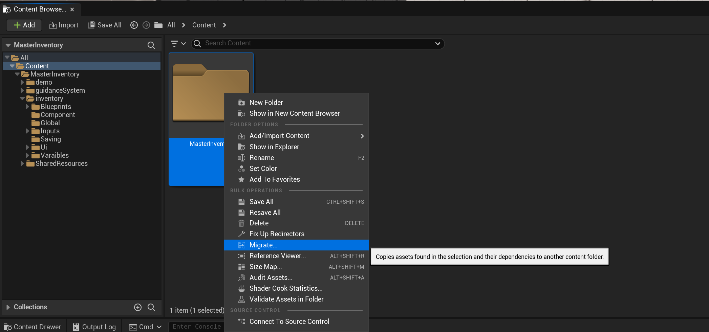
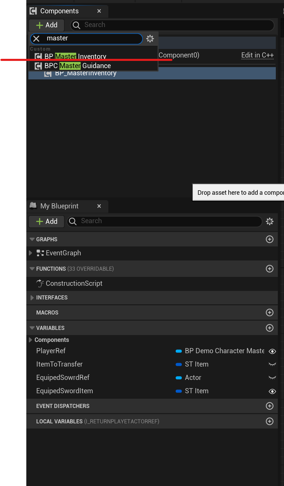
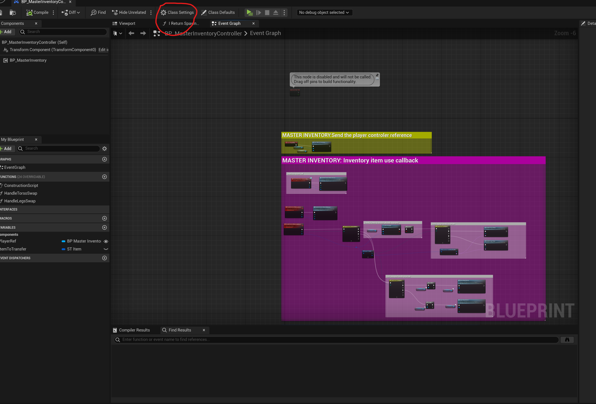
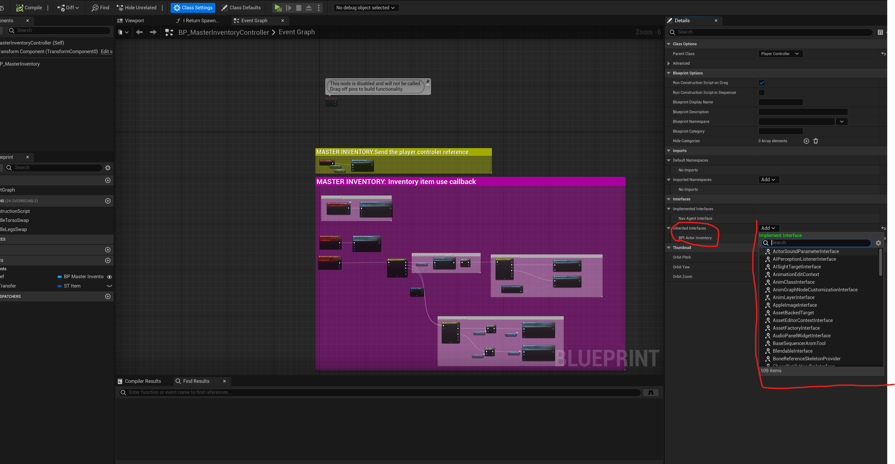
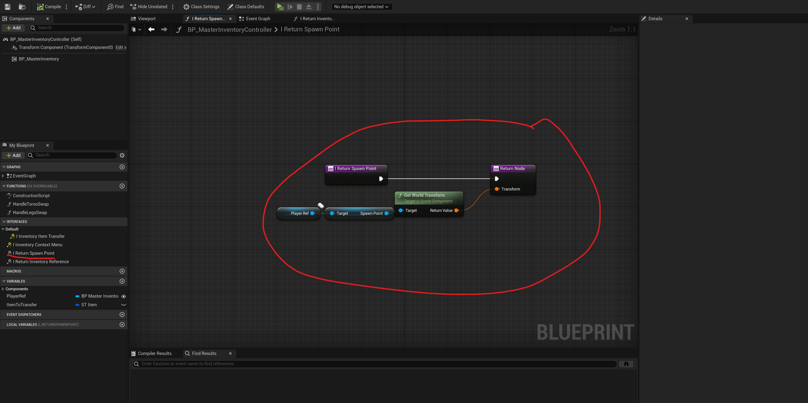
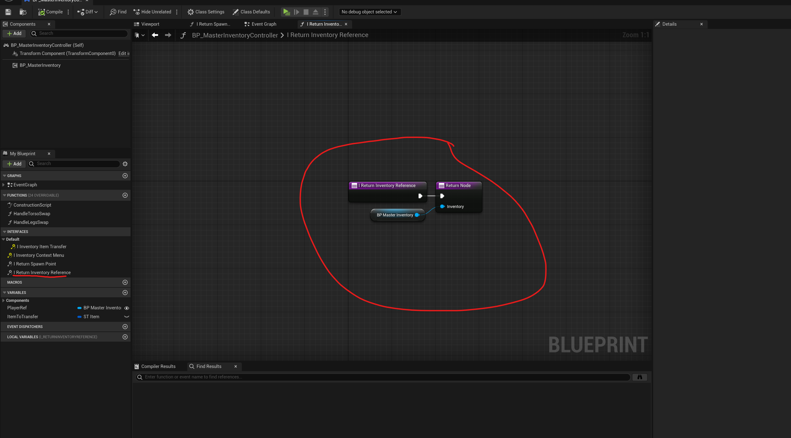
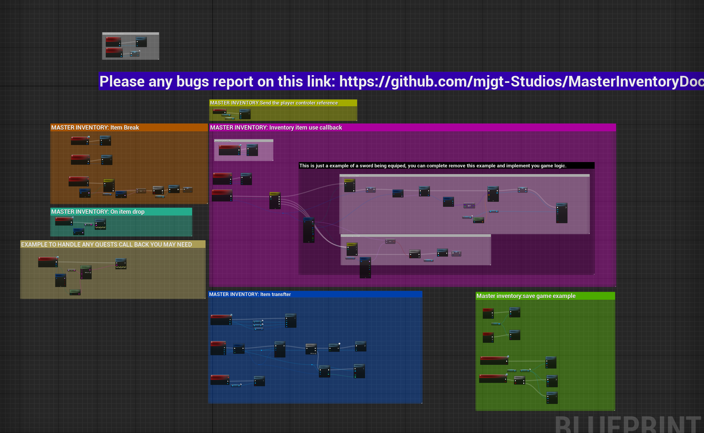

# Master Inventory

Thanks for purchasing Master Inventory follow this docs to learn how easy is to implement in you game.

## Requirements

- Unreal engine 5.2 or above, i am using the new input system so old engine version this function will not work
- Awesome game.

## Installation

### 1: First migrate the project folder to your project folder




### 2: Now in your player controller add the master inventory component

```javascript
BP_MasterInventory
```


### 3: Now you need to add the master inventory interface to your player controller

Now in order for the master inventory to work you need to implement the interface in your player controller.

```javascript
BPI_ActorInventory
```
To implement the interface follow the next steps

### 1: Click in the class settings



### 2: Add the [BP_MasterInventory]('#') to the player controller



### 3: Now you need to implement return interfaces follow the imgs

This interface will return where you want to spawn the item normally you create a spawn point and attach to the character.



This interface will return the inventory reference `THIS IS VERY IMPORTANT`



Now if you look in the demo controller you will see the implementation of some events that you can use to customize the inventory, copy and paste the code in your controller and customize it to your needs.



### Congratulations you have successfully install the master inventory

## Information links
[tutorial-setup](https://youtu.be/87jMTX83RpI)
[Asset-Link](https://www.unrealengine.com/marketplace/en-US/product/b5c3ee6da047491a958b499c7f027713)

