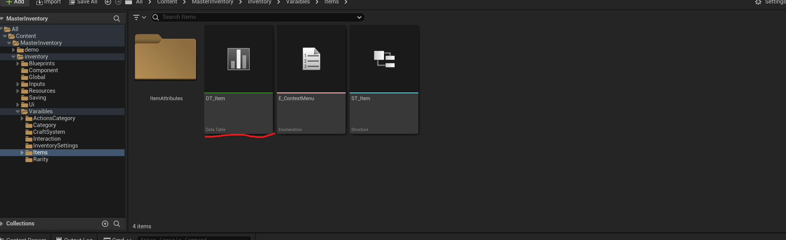
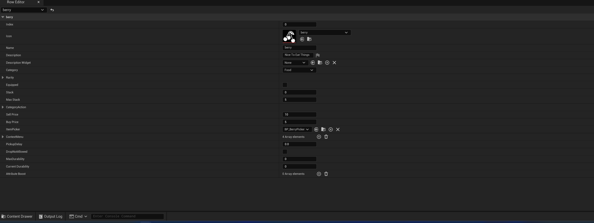
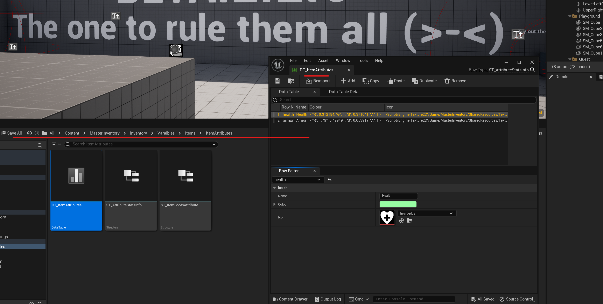
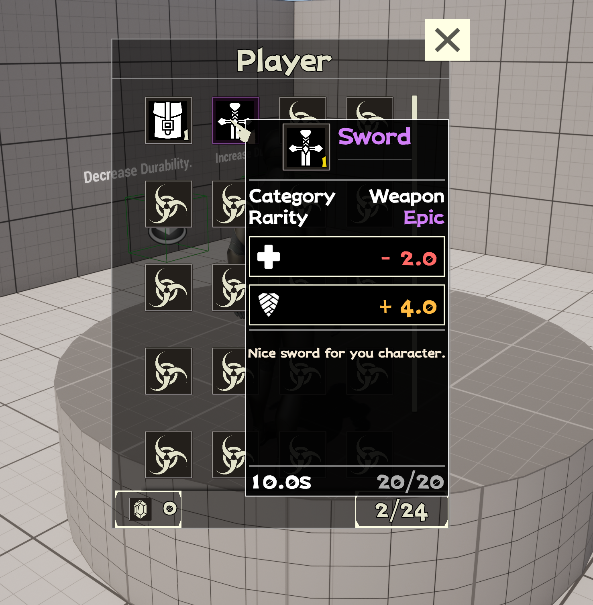

## Item Creation

The easiest way to create a new item is to duplicate existing item and change the name and the mesh, if you want to create a new item from scratch you need to follow the steps below.

### 1: navigate to `(MasterInventory/inventory/Variables/Items)`

In this folder open the follow file DT_Item, this file controls all the inventory items available

When editing the item pay attention to the following fields

| Variable Name             | Description                                                                |
| ----------------- | ------------------------------------------------------------------ |
| Index | Used internally for reference internally so master inventory knows what item to change |
| Icon | Icon that will display in the master inventory |
| Name | Item display name |
| Description | Used in the item details widget |
| Description Widget | Used in the item details widget, a dynamic widget will be created and add on top in the item details |
| Category | Can be used to handle different actions |
| Rarity | Item Rarity used in the name and description display |
| Equipped | Is the item Equipped ? used internally |
| Stack | How many of the items the player have, used internally |
| Max Stack | How many max stacks per slot you want per slot |
| Category action | Can be to equip items, spawn items and etc, the sword item has a more details example. |
| Sell Price | Not in use yet |
| Buy Price | Not in use yet |
| Item Picker | The actor that will be used to pick the item in the world |
| Context Menu | Actions this item can handle |
| Pickup Delay | Time delay to pick the item, lets say you want to use a animation first |
| Drop Not Allowed | That means the item once pickup will not be dropped |
| Max Durability | How durable the item is. |
| Current Durability | If below 0 the item will be deleted |
| Attribute Boost | Lets say you want to increase the player health you can create custom stats and use this in the callback |
| Use Cooldown | How long the item will be on cooldown |
| Cooldown Time | How long the item will be on cooldown |
| ActionSlotAction | What action you want to use when the player use the item in the action slots. |

## Item Picker (BP_BaseItemPicker)
The item Picker is what the player or any actor with the Master Inventory can interact with, here is a list of functions that you can override when customizing a item, i recommend creating a children actor so you don't override the default MasterInventory Picker.

| Function Name             | Description                                                                |
| ----------------- | ------------------------------------------------------------------ |
| OnActorDestroy | Used When the MasterInventory pickup the item |
| ActorInRange | When a actor with the MasterInventory is in range |
| ActorOutOfRange | When a actor with the MasterInventory is out range |
| Object Interaction Client | When a actor with the MasterInventory interact with the object, note that the event runs in the Client |

## Chest Actor (BP_BaseChest)
The chest base actor is quite simple, the best also extends from BP_BaseItemPicker so you have all the functions above but we have some extra variable settings you can use to configure the chest item.

| Variable Name             | Description                                                                |
| ----------------- | ------------------------------------------------------------------ |
| InUse | Means that another actor is using the chest |
| ChestId | Used so the system can save the chest item and the items inside |
| DynamicChestId | Normally used for dynamic spawned chests |

## ItemAttributes

To manage ItemAttributes navigate to (MasterInventory/inventory/Variables/Items/ItemAttributes) open the file DT_ItemAttributes

When editing the item pay attention to the following fields
| Variable Name             | Description                                                                |
| ----------------- | ------------------------------------------------------------------ |
| Name | Stats name |
| Color | Color that will display in the master inventory |
| Icon | Icon that will display in the master inventory |

Example of how to use the ItemAttributes is in the sword item, you can use the item attributes to create custom stats for your game, and the stats should be used in the item details widget.

