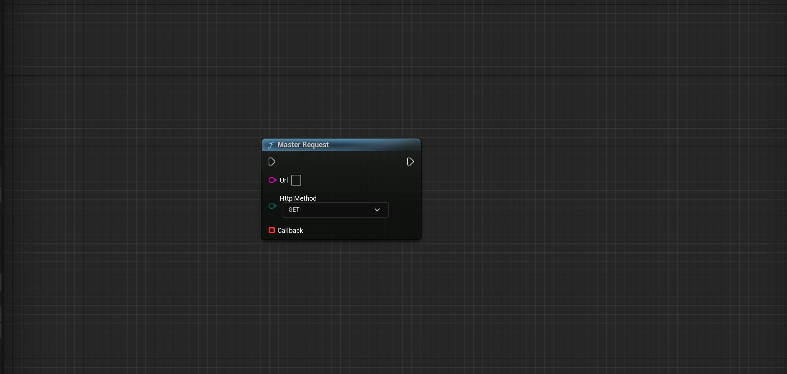
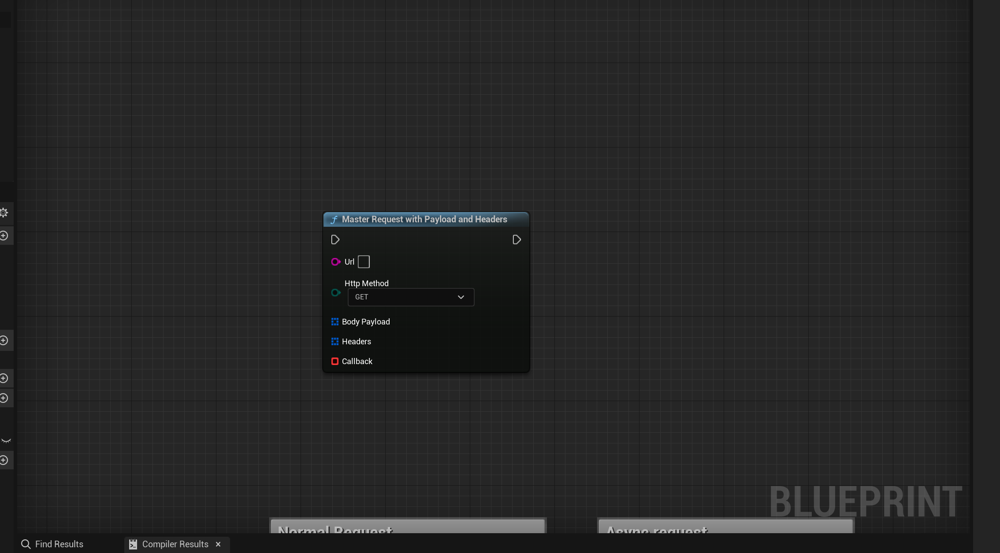
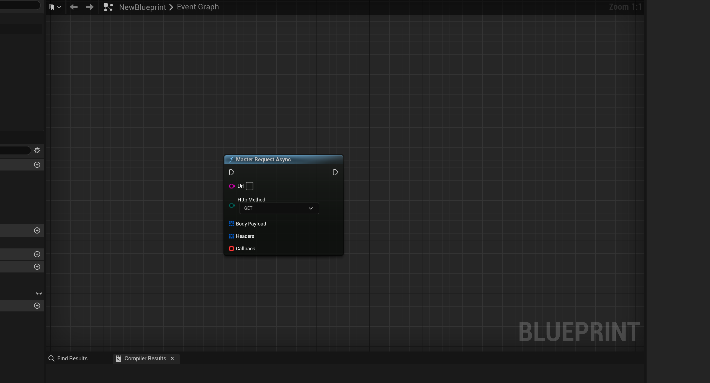
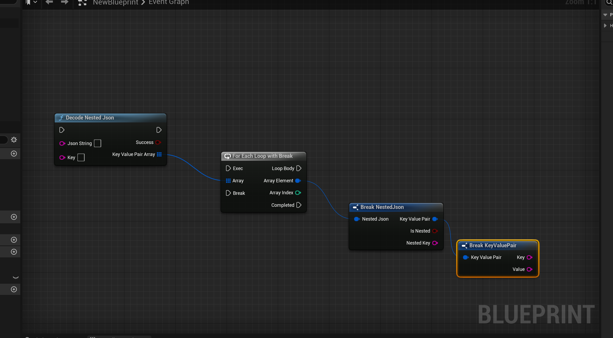
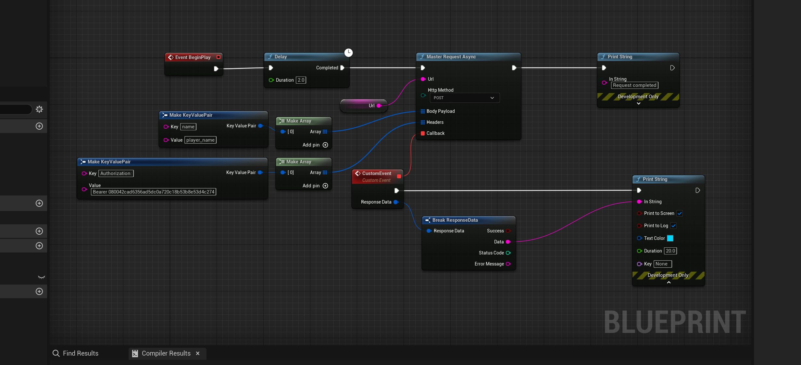

# The widget system

Master Http Request unreal engine 5 plugin is a plugin that allow you to make http request in a simple way.

## Available Blueprints

- [Master Request](#master-request)
- [Master Request With Payload And Headers](#master-request-with-payload-and-headers)
- [Master Request Async](#master-request-async)
- [Decode Json](#decode-json)
- [Decode Nested Json](#decode-nested-json)

# Master Request

#### Inputs

| Name | Type | Description |
| --- | --- | --- |
| url | String | The url of the request |
| Http Method | String | The method of the request |

# Master Request With Payload And Headers

#### Inputs

| Name | Type | Description |
| --- | --- | --- |
| url | String | The url of the request |
| Http Method | String | The method of the request |
| Body Payload | Array of structs | The body payload of the request |
| Headers | Array of structs | The headers of the request |

# Master Request With Payload And Headers Async

This node is the same as the previous one but it is async, so it will not block the main thread, execute the response in a event.

#### Inputs

| Name | Type | Description |
| --- | --- | --- |
| url | String | The url of the request |
| Http Method | String | The method of the request |
| Body Payload | Array of structs | The body payload of the request |
| Headers | Array of structs | The headers of the request |

# Decode Json

Some times you need to grab a value from a json, this node will help you to do that, i a very simple you just need the json string and the key of the value that you want to grab.

#### Inputs

| Name | Type | Description |
| --- | --- | --- |
| Json String | String | The json string |
| Key | String | The key of the value that you want to grab |

#### Outputs

| Name | Type | Description |
| --- | --- | --- |
| success | Boolean | If the json was decoded successfully |
| value | String | The value of the key |

# Decode Nested Json

Some times you have complex jsons, this node will help you to grab a value from a nested json, i a very simple you just need the json string and the key of the value that you want to grab.

#### Inputs

| Name | Type | Description |
| --- | --- | --- |
| Json String | String | The json string |
| Key | String | The key of the value that you want to grab |

#### Outputs

| Name | Type | Description |
| --- | --- | --- |
| success | Boolean | If the json was decoded successfully |
| Array Of Nested Json | Array of structs | The value of the key |

# Usage example

