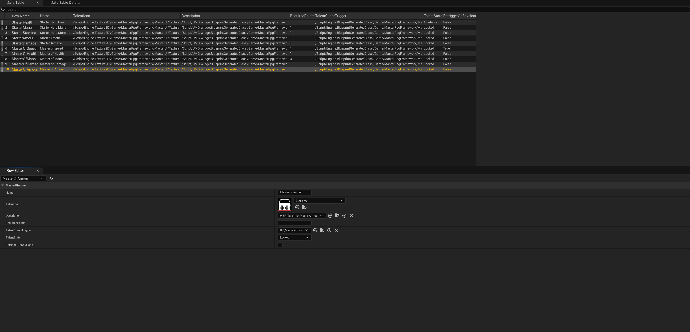
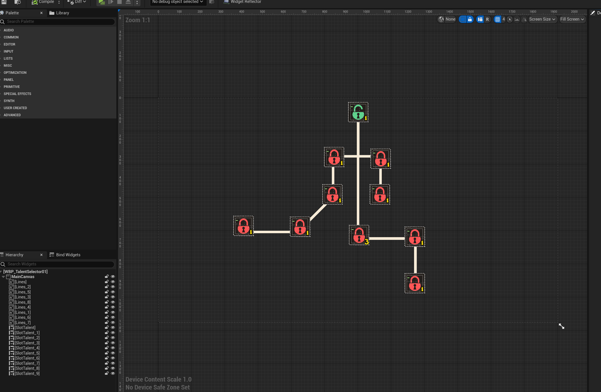

Master Inventory also comes with a powerful talent system that allows you to add custom talents to your player.

## Talent system overview

Creating a new talent system.

1. Open a new `DT_TalentsList` Locate at `MasterInventory/Content/MasterRpgFramework/MasterInventory/Variables/TalentSystem/DT_TalentsList`

| Parameter |  Description                       |
| :-------- |  :-------------------------------- |
| `Name` | Talent name. |
| `Talent icon` | Talent icon. |
| `description` | Talent description, this is a widget that will be added to display the talent information. |
| `Required Points` | Talent required points to unlock. |
| `Talent Class Trigger` | **Important** Talent class trigger, this is a blueprint that will be called when the talent is unlocked. |
| `Talent State` | Talent state, this is a enum that will be used to check if the talent is unlocked or not. |
| `Retrigger On Save Load` | Retrigger On Save Load, this will retrigger the talent class trigger when the game is loaded. |

2. The `Talent State` we have 3 states, `Locked`, `available` and `taken`.

## Talent class trigger

This class will be used to create the talent logic, this class must inherit from `BP_BaseTalentActor` class, lets take this `BP_StarterHealth` as example.

This class have 2 main method you can override, `UnlockTalent` and `TalentRevert`, this methods will be called when the talent is unlocked or reverted.

## Creating a new talent tree

Lets take this as example `WBP_TalentSelector01` locate at `MasterInventory/Content/MasterRpgFramework/MasterInventory/Ui/Talents/TalentListsWidget/WBP_TalentSelector01`

if you follow this example you should be able to create a new talent tree.

## Information links
[tutorial-setup](https://www.youtube.com/watch?v=GsixQA2m5Yw&t=582s)
